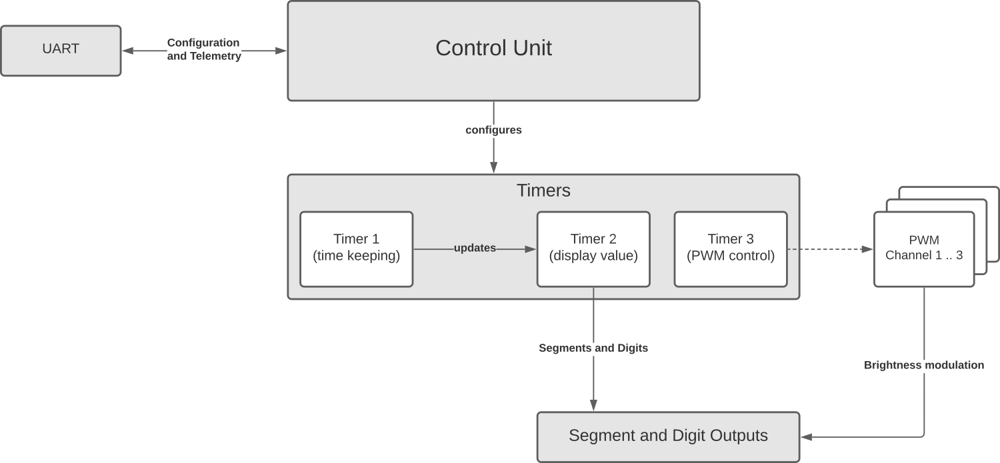

# AS2201
The AS2201 is a PWM-dimmable, 4 digit, 7-segment display driver. It can be fed with data using UART or generate the display data from various counters.

## Features
- 4 digit 7-segment display driver
- dimmable using PWM
- UART interface
- 1, 1/10, 1/100 and 1/1000 second counter mode
- rising/falling edge counter mode
- quadrature counter mode
- up, down and up/down counter mode

## General Architecture

## Misc
- Naming: AS2201 = My initials (**A**. **S**.) + month of development 20**22**/**01**
- License: Creative Commons  (CC-BY)